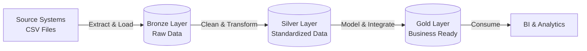

# SQL-data-warehouse-project
Building a modern data warehouse with SQL Server, including ETL processes, data modeling, and analytics.

# 🏭 SQL Data Warehouse Project (Medallion Architecture)

## 📌 Project Overview
This project demonstrates a complete **End-to-End Data Engineering** solution using **Microsoft SQL Server**. The goal is to build a modern Data Warehouse based on the **Medallion Architecture** (Bronze, Silver, Gold layers) to consolidate data from disparate source systems (ERP and CRM) into a unified, business-ready data model.

The project covers the full lifecycle of data: from data ingestion (ETL) to data cleaning, integration, and finally, data modeling for analytics.

---

## 🏗️ Data Architecture (Medallion)

The solution is designed using a layered architecture to ensure data quality and scalability:

### 1. 🥉 Bronze Layer (Raw Data)
*   **Purpose:** Ingest raw data from source systems (CRM & ERP) "as-is".
*   **Method:** Bulk Insert via Stored Procedures.
*   **Format:** Physical Tables.
*   **Strategy:** Full Load (Truncate & Insert). No transformations are applied here to ensure traceability.

### 2. 🥈 Silver Layer (Clean Data)
*   **Purpose:** Cleanse, standardize, and integrate data.
*   **Transformations:**
    *   **Data Cleansing:** Handling NULLs, trimming whitespace, standardizing text (e.g., mapping 'M' to 'Male').
    *   **Data Typing:** Casting string dates to proper Date objects.
    *   **Deduplication:** Removing duplicate records using Window Functions.
    *   **Data Integration:** Merging CRM and ERP customer data into a single entity.
*   **Format:** Physical Tables.

### 3. 🥇 Gold Layer (Presentation Data)
*   **Purpose:** Provide a simplified view for analytics and reporting.
*   **Data Model:** **Star Schema** (Kimball methodology).
*   **Components:**
    *   **Fact Tables:** Transactional data (Sales).
    *   **Dimension Tables:** Descriptive data (Customers, Products).
*   **Format:** Database Views (Virtual Tables).

---

## 🛠️ Tech Stack & Concepts

*   **Database:** Microsoft SQL Server (Express Edition)
*   **Tool:** SQL Server Management Studio (SSMS)
*   **Language:** T-SQL (Transact-SQL)
*   **Key Concepts Applied:**
    *   DDL (Data Definition Language) for Schema Design.
    *   Stored Procedures for ETL Automation.
    *   Views for Data Modeling.
    *   Window Functions (`ROW_NUMBER`) for Deduplication.
    *   Data Quality Checks.

---

## 📂 Data Model (Star Schema)

The final Gold Layer is modeled to support efficient querying:

*   **Fact Table:**
    *   `fact_sales`: Central table containing sales metrics (Quantity, Amount) and foreign keys.
*   **Dimension Tables:**
    *   `dim_customers`: Unified customer details from CRM and ERP.
    *   `dim_products`: Product catalog with categories.

---

## 🚀 How to Run the Project

### Prerequisites
1.  Install **SQL Server** and **SSMS**.
2.  Clone this repository.

### Execution Steps
1.  **Database Setup:**
    *   Run `scripts/init_database.sql` to create the database and schemas (`bronze`, `silver`, `gold`).
2.  **ETL Execution (Bronze):**
    *   Execute `scripts/bronze/proc_load_bronze.sql` to create the stored procedure.
    *   Run `EXEC bronze.load_bronze` to ingest CSV data.
3.  **ETL Execution (Silver):**
    *   Execute `scripts/silver/proc_load_silver.sql`.
    *   Run `EXEC silver.load_silver` to clean and populate silver tables.
4.  **Data Modeling (Gold):**
    *   Run the scripts in `scripts/gold/` to create the final Views.

---

## 📊 Data Quality Tests
Included in the `tests/` folder are SQL scripts to validate:
*   [x] Uniqueness of Primary Keys.
*   [x] Relationship integrity (Foreign Keys).
*   [x] Data consistency across layers.

---

